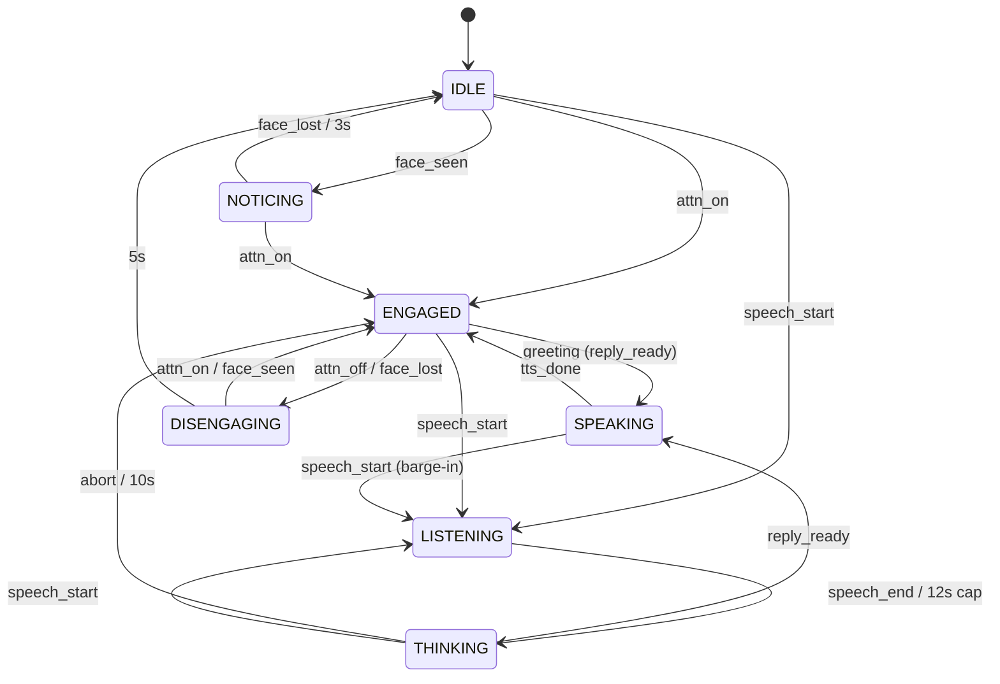

# Lumi: live character lamp

A 5-DOF desk lamp character that notices you looking at it, greets you with motion, light, a chirp and voice, holds a spoken conversation, remembers objects it sees on your desk, and plays (and dances to) music.

## Run

```bash
make install      # Python 3.11 venv (mediapipe needs <= 3.12), copies .env.example to .env
# put the supplied files at robot/dummy_lamp_6dof.urdf and robot/assets/lamp_shade.stl
make fake         # offline, canned speech
make run          # uses .env (PROVIDERS=cloud + keys for real speech)
```

Open http://localhost:8000 in **Chrome**, press Start, allow camera + mic. The PyBullet window shows the body. Headphones are not needed (browser echo cancellation + VAD tightening while speaking), but they make barge-in more reliable.

`make test` runs unit tests plus a headless end-to-end WebSocket test with fake providers. `make urdf` and `make render` help map the body to the URDF.

## Architecture

```
Browser (I/O surface)                     Python server (all decisions)                 PyBullet process
 camera 5 fps JPEG ─┐                      ┌─ AttentionTracker (local MediaPipe) ─┐
 mic 16k PCM 20 ms ─┼─ one WebSocket ──────┼─ VAD (webrtcvad, local)              ├─> FSM + Affect ─> Body (20 Hz) ── mp.Queue ─> joints + shade color
                    │  [1B kind][payload]  ├─ Scene VLM every 4 s ─> SceneMemory  │         │
 speaker <──────────┘  + JSON control      └─ STT -> LLM(tool JSON) -> TTS stream ┘         └─> sfx / music / voice cues to browser
```

| Path | Files |
|---|---|
| Transport | `app/protocol.py`, `app/main.py` |
| Orchestration | `app/session.py` (one connection = one interaction) |
| Engagement + emotion | `app/core/fsm.py` |
| Perception | `app/vision/attention.py`, `app/audio/vad.py` |
| Mind | `app/providers/` (fake + cloud), `app/mind/memory.py` |
| Body | `app/body/behaviors.py` (procedural animation + light), `app/body/sim.py` |
| Client | `client/index.html` (capture, playback, synthesized SFX + music) |

## State machine



Engagement is discrete; emotion is a continuous valence/arousal vector layered on top. Each state has a baseline mood, perception events apply instant impulses (a face appearing spikes arousal before any model runs), and the LLM sets a held emotion that decays back to baseline. The body reads both, so "engaged + excited" moves faster and brighter than "engaged + sleepy".

## Demo script (one continuous take)

1. **Idle**: lamp slumped, dim warm light, slow breathing. Scene scans are already filling memory.
2. **Engagement**: look at the laptop. `notice` chirp, lamp perks up and turns toward your face. Attention confirmed: `greet` chime, bounce, light brightens, spoken greeting.
3. **Spoken interaction**: "What's on my desk?" Listen blip, head tilt, thinking pulse, spoken answer grounded in the current scene.
4. **Scene memory**: show a mug, then put it out of frame. Later: "Where did I leave my mug?" Answer comes from memory with recency ("left of the keyboard, 2 min ago").
5. **Music**: "Play me something." Lamp says so, then generative music starts, lamp dances on tempo, light cycles colors. Music ducks while you talk.
6. **Disengagement**: look away. Lamp lingers, droops, `sleep` sound, music stops, returns to idle.

## Real-time budget

| Loop | Target | How |
|---|---|---|
| Face notice / gaze follow | < 300 ms | local detector at 5 fps, latest-frame-wins, debounced |
| End of speech -> first audio | ~1.5 to 2.5 s | 600 ms VAD hangover, small STT + Haiku-class LLM, streamed TTS |
| Motion | 20 Hz targets, 240 Hz sim | smoothing rate scales with arousal |
| Barge-in stop | < 200 ms | server purges queued audio, client stops sources |

Filler motion (tilt, pulse, sfx) covers the language latency so the character never looks frozen.

## Cloud usage and data

| Data | Sent to | When | Why |
|---|---|---|---|
| Utterance audio (WAV, only between VAD start/end) | OpenAI transcription | each turn | fast, accurate STT without a local model |
| Transcript, short history, retrieved memories, mood | Anthropic LLM | each turn | character dialogue + structured emotion/gesture/music |
| One JPEG every 4 s | Anthropic vision | continuously | object naming/locations for memory |
| Reply text | OpenAI TTS | each turn | expressive voice, streamed PCM |

Stays local: all continuous video for attention, continuous mic audio (VAD), the state machine, memory store (Chroma on disk), motion, light, SFX, music. Every behavioral decision (when to engage, greet, listen, interrupt, sleep) is local; the cloud only supplies words and scene descriptions. `PROVIDERS=fake` sends nothing.

## Decisions and trade-offs

- **Local attention, cloud scene understanding.** Engagement must be fast and cheap, so it never waits on a network call; object naming tolerates seconds of latency.
- **Nose-offset gaze heuristic** instead of a gaze model: robust enough at desk distance, zero training. Fails on strong side lighting or glasses glare.
- **Turn-based STT** (VAD-segmented) instead of streaming STT: simpler and reliable in the timebox; costs ~300 to 600 ms.
- **Tool-forced JSON** from the LLM so emotion/gesture/music are always parseable.
- **Latest-location memory** keyed by object name: answers "where is X" well; loses location history.
- **Synthesized SFX and music** in the browser: no licensing, tempo-locked to the dance.
- **PyBullet in its own process**: GUI owns its main thread (macOS), and a sim crash can't take down the conversation.

## Completed vs left out

Completed: engagement FSM with disengagement, affect layer, multimodal I/O over one socket, barge-in, scene memory with recency, procedural motion + light, SFX, music with dancing, offline fake mode, unit tests.

Left out on purpose: streaming STT and sentence-level TTS pipelining, speaker identity, multi-person arbitration, object re-identification across renames, sound localization, learned gaze.
