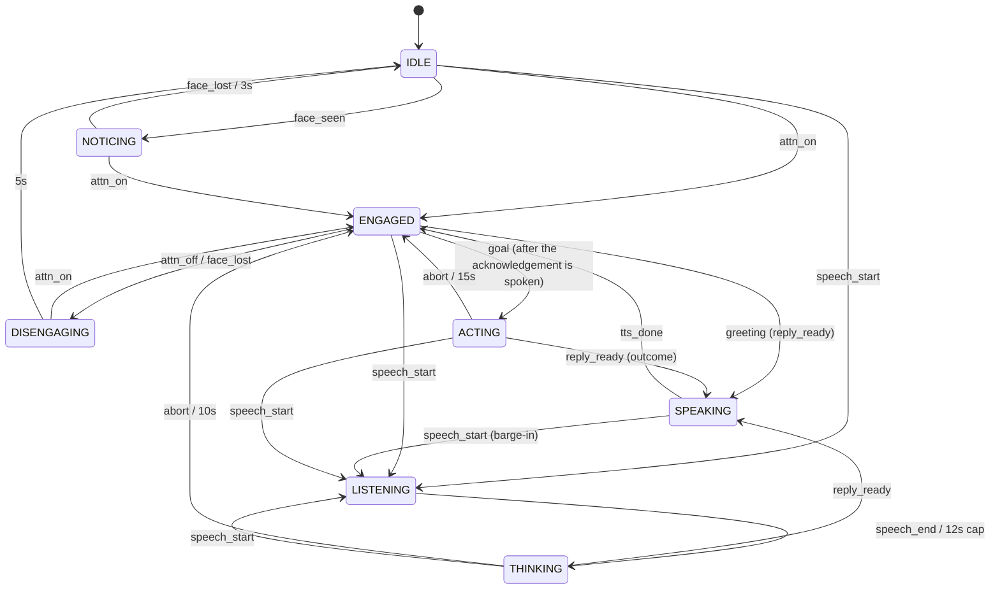

# Lumi: live character lamp

A 5-DOF desk lamp character that notices you looking at it, greets you with motion, light, a chirp and voice, holds a spoken conversation, remembers objects it sees on your desk, and plays (and dances to) music.

## Run

**Target: Ubuntu 24.04 LTS** (4 cores, 8 GB, integrated GPU, no CUDA). Written for it but not yet run on a real Ubuntu machine; developed and measured on macOS (see Measurements).

```bash
git clone <repo> ~/lumi && cd ~/lumi
bash deploy/setup_ubuntu.sh   # apt packages, Chromium, venv on Python 3.12, pinned deps, tests, headless render
# edit .env: PROVIDERS=cloud, ANTHROPIC_API_KEY, OPENAI_API_KEY   (PROVIDERS=fake needs no keys or network)
make run                      # or run at login: deploy/lumi.service (systemd user unit, instructions inside)
```

Open http://localhost:8000 in **Chromium or Chrome**, press Start, allow camera + mic. Camera and mic are read by the browser (V4L2, PipeWire/PulseAudio), so the Python side needs no audio or camera drivers. The PyBullet window shows the body; `SIM=false` skips it on a headless box. Headphones are not needed (browser echo cancellation plus a stricter VAD while the lamp speaks), but they make barge-in more reliable.

**macOS (development):** `make install` builds a patched pybullet first (no arm64 wheel; about 2 min), then the same commands.

| Command | What it does |
|---|---|
| `make fake` / `make run` | server with canned providers (offline) / with `.env` |
| `make test` / `make lint` | unit tests plus end-to-end WebSocket tests with fakes / ruff |
| `make urdf` / `make render` | joint table and role mapping / headless PNGs of every pose in `out/poses/` |
| `make sweep` / `make poses` | PyBullet window: each joint alone / every state and gesture |
| `make trace` | summarize the last session: engagement latency, flapping, yaw spread, turn latency |
| `make cloudcheck` | time each cloud call with synthetic inputs (needs keys) |
| `make load` | CPU and memory under a client-like load with fake providers (`--sim` to include the window) |

## Architecture

```
Browser (I/O surface)                     Python server (all decisions)                 PyBullet process
 camera 5 fps JPEG ─┐                      ┌─ AttentionTracker (local MediaPipe) ─┐
 mic 16k PCM 20 ms ─┼─ one WebSocket ──────┼─ VAD (webrtcvad, local)              ├─> FSM + Affect ─> Body (20 Hz) ── mp.Queue ─> joints + shade color
                    │  [1B kind][payload]  ├─ Scene VLM every 4 s ─> SceneMemory  │         │
 speaker <──────────┘  + JSON control      └─ STT -> LLM(tool JSON) -> TTS stream ┘         └─> sfx / music / voice cues to browser
```

| Path | Files |
|---|---|
| Transport | `app/protocol.py`, `app/main.py` |
| Orchestration | `app/session.py` (one connection = one interaction) |
| Engagement + emotion | `app/core/fsm.py` |
| Perception | `app/vision/attention.py`, `app/audio/vad.py` |
| Mind | `app/providers/` (fake + cloud), `app/mind/memory.py` |
| Body | `app/body/behaviors.py` (procedural animation + light), `app/body/sim.py` |
| Client | `client/index.html` (capture, playback, synthesized SFX + music) |

## State machine



Engagement is discrete; emotion is a continuous valence/arousal vector layered on top. Each state has a baseline mood, perception events apply instant impulses (a face appearing spikes arousal before any model runs), and the LLM sets a held emotion that decays back to baseline. The body reads both, so "engaged + excited" moves faster and brighter than "engaged + sleepy".

## Goal-directed action

"Shine your light on my mug" goes through two layers with a hard boundary:

- **Models choose what.** The LLM's structured reply carries `action: {do: spotlight | look, target: "<visible object name>"}` plus a short acknowledgement. The scene VLM reports each object's name, location, and image position.
- **The body decides how, locally.** A planner in `Session._run_goal` finds the target (re-scanning if it is not in the current scene), aims head and light at its image position, waits until the joints have actually arrived (motion is velocity-limited), switches to a white spotlight, re-observes the scene, and verifies the target is still where it aimed. If it moved it re-aims once; if it is gone or never found, it says so. The outcome line is spoken with the light still on the target, then the lamp turns back to the user.

The action set is closed (`look_at`, `light`, `observe`, `verify`, `return`), so a model can never command joint angles, speeds, or timing. Every step is sent to the client and the trace as a `goal` message with its time since the goal started.

## Demo script (one continuous take)

1. **Idle**: lamp slumped, dim warm light, slow breathing. Scene scans are already filling memory.
2. **Engagement**: look at the laptop. `notice` chirp, lamp perks up and turns toward your face. Attention confirmed: `greet` chime, bounce, light brightens, spoken greeting.
3. **Spoken interaction**: "What's on my desk?" Listen blip, head tilt, thinking pulse, spoken answer grounded in the current scene.
4. **Goal-directed action**: with a mug on the desk, "Shine your light on my mug." Short acknowledgement, the lamp leans over and aims at the mug, the light snaps to a white spotlight with a `spot` ding, it re-checks the scene (move the mug and it re-aims once), then "There! Your mug is in my spotlight."
5. **Scene memory**: put the mug out of frame. Later: "Where did I leave my mug?" Answer comes from memory with recency ("left of the keyboard, 2 min ago").
6. **Music**: "Play me something." Lamp says so, then generative music starts, lamp dances on tempo, light cycles colors. Music ducks while you talk.
7. **Disengagement**: look away. Lamp lingers, droops, `sleep` sound, music stops, returns to idle.

## Real-time budget

| Loop | Target | How |
|---|---|---|
| Face notice | ~0.4 s | local detector at 5 fps (7 to 12 ms per frame), 2-frame debounce |
| Engagement (attention confirmed, greeting starts) | < 1 s | 3-frame debounce with yaw hysteresis; greeting motion + chime 0.4 s before the voice |
| End of speech -> first audio | ~1.5 to 2.5 s | 600 ms VAD hangover, small STT + Haiku-class LLM, streamed TTS |
| Goal (aim, spotlight, re-check, outcome) | ~2.5 to 4 s | aim waits for velocity-limited joints (~0.8 s), then one cloud scene scan |
| Motion | 20 Hz targets, 240 Hz sim | soft joint limits and URDF velocity limits enforced on every command |
| Barge-in stop | < 200 ms | server purges queued audio, client stops sources |

Filler motion (tilt, pulse, sfx) covers the language latency so the character never looks frozen.

## Measurements

Measured on the development machine (MacBook Air M3, 8 GB, macOS 26) unless noted. Live rows fill in from `make trace` after a real session.

| What | Result | How |
|---|---|---|
| Server CPU under client-like load | 0.19 cores (2% of 8) | `make load`: 5 fps JPEG, 50 Hz mic chunks, a turn every 10 s, fake providers |
| Server memory | 127 MB idle, 370 MB median, 484 MB peak | same run (MediaPipe + Chroma loaded) |
| Sim loop (headless) | 0.03 cores, 42 MB | PyBullet DIRECT at 240 Hz with 20 Hz targets; the GUI window adds rendering on top |
| Face detection per frame | 7 to 12 ms (first frame 23 ms after warm-up; 1115 ms before it existed) | session trace |
| Memory search | 112 to 126 ms | Chroma, 3 objects, off the event loop |
| Goal with fake providers | aim settled 0.83 s, verified 1.33 s | goal messages |
| VAD end of utterance in steady noise | 0.1 to 0.35 s after speech, 10 of 10 noise conditions (was 3 of 10) | recorded utterance in white/pink/brown noise |
| Engagement latency, flapping, disengagement | pending live session | `make trace` |
| STT, LLM, first audio (median, p90) | pending keys | `make cloudcheck`, then 10 live turns |
| Ubuntu target CPU/memory | pending (not run on Ubuntu yet) | `make load --sim` on the target |

## Hardware used

MacBook Air (Apple M3, 8 GB RAM, integrated GPU): built-in 720p camera, built-in microphones and speakers, Chrome. No external devices. The Ubuntu 24.04 target is supported by the setup script and service file but has not been run on real hardware.

## Cloud usage and data

| Data | Sent to | When | Why |
|---|---|---|---|
| Utterance audio (WAV, only between VAD start/end) | OpenAI transcription | each turn | fast, accurate STT without a local model |
| Transcript, short history, retrieved memories, mood | Anthropic LLM | each turn | character dialogue + structured emotion/gesture/music |
| One JPEG every 4 s, plus one per goal re-observation | Anthropic vision | continuously; during goals | object names, locations, and image positions for memory and goal aiming |
| Reply text; the 3 fixed greeting lines once at session start | OpenAI TTS | each turn; session start | expressive voice, streamed PCM; greetings cached so the voice lands on its beat |

Stays local: all continuous video for attention, continuous mic audio (VAD), the state machine, memory store (Chroma on disk), motion, light, SFX, music, and the session trace (`out/traces/`, numbers only, used for the measurements). Every behavioral decision (when to engage, greet, listen, interrupt, sleep) is local; the cloud only supplies words and scene descriptions. `PROVIDERS=fake` sends nothing.

## Decisions and trade-offs

Full log with evidence: `docs/DECISIONS.md`.

- **Local attention, cloud scene understanding.** Engagement must be fast and cheap, so it never waits on a network call; object naming tolerates seconds of latency.
- **Nose-offset gaze heuristic** instead of a gaze model: robust enough at desk distance, zero training. Fails on strong side lighting or glasses glare. Hysteresis (on below 0.25, off above 0.40) and debouncing keep it from flapping; attention is re-checked every frame so the lamp never stays engaged after you look away mid-reply.
- **Turn-based STT** (VAD-segmented) instead of streaming STT: simpler and reliable in the timebox; costs ~300 to 600 ms. webrtcvad alone never closed utterances in steady room noise, so a frame must also beat the measured noise floor.
- **Tool-forced JSON** from the LLM so emotion, gesture, music, and goals are always parseable.
- **Models choose what, the body decides how.** Goals are a closed action set run by a local executor; models never command joints or timing.
- **Physical limits in the body, not the sim.** Commands stay inside the URDF soft limits and under its velocity limits. The scaffold's gestures needed 3 to 6 rad/s against 0.95 to 1.6 rad/s limits and were retuned. There is no roll joint, so a head cock is neck yaw on the tilted upper arm with an opposite base yaw (18 deg roll, facing the user).
- **Latest-location memory** keyed by object name: answers "where is X" well; loses location history.
- **Synthesized SFX and music** in the browser: no licensing, tempo-locked to the dance.
- **PyBullet in its own process**: GUI owns its main thread (macOS), and a sim crash can't take down the conversation. On a real lamp the same 20 Hz frame queue would feed a motor driver process instead.

## Completed vs left out

Completed and tested offline (30 tests, fake providers): engagement FSM with disengagement and flapping guards, affect layer, multimodal I/O over one socket, barge-in, scene memory with recency, goal-directed action (spotlight or look at a named object, re-observe, re-aim once), procedural motion and light within joint limits, SFX, music with dancing, offline fake mode, Ubuntu setup script and systemd unit.

Not yet verified live: engagement thresholds on a real face, cloud latency, barge-in on laptop speakers, the goal and memory moments with real vision, the Ubuntu install.

Left out on purpose: streaming STT and sentence-level TTS pipelining, speaker identity, multi-person arbitration, object re-identification across renames, sound localization, learned gaze, visual servoing (the camera is the laptop's, not the lamp's `camera_link`, so aiming cannot be checked through the lamp's own view).
