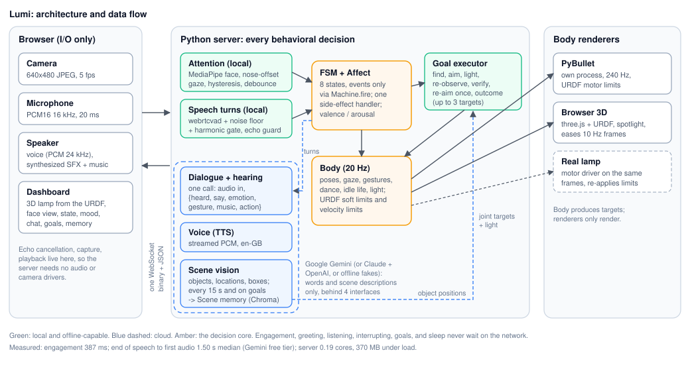

# Lumi: technical note

Lumi is a live character around the supplied 5-DOF lamp. The laptop camera and mic are its senses, the speaker its voice, SFX and music, and a PyBullet model of the URDF its body and light. One Python process makes every behavioral decision; the cloud supplies only words and scene descriptions.

## Architecture and data flow

**Protocol.** One WebSocket per interaction. Binary frames are `[kind byte][payload]`: mic PCM16 16 kHz in 20 ms chunks, camera JPEG, and TTS PCM16 24 kHz out. Control is JSON text (`state`, `transcript`, `scene`, `body`, `sfx`, `music`, `goal`, `tts_start/end`, `stop_audio`, `speak`; client sends `playback_done` and typed text). Ordered delivery makes barge-in simple: the server purges queued audio and tells the client to stop. The browser owns capture and playback, so the server needs no audio or camera drivers; SFX and music are synthesized in the browser, tempo-locked to the dance.

**Orchestration.** A discrete engagement FSM (IDLE, NOTICING, ENGAGED, LISTENING, THINKING, SPEAKING, ACTING, DISENGAGING) is the only way state changes; all side effects live in one transition handler. A continuous valence/arousal affect rides on top: perception events give instant impulses, the LLM sets a held emotion, each state has a baseline. Blocking work (detection, memory) runs in threads; network calls are async with 10 s timeouts. Cloud models sit behind four small provider interfaces (STT, LLM, scene, TTS): Google Gemini with one key by default, Anthropic + OpenAI as an alternative, and offline fakes for tests. If cloud TTS fails, the browser speaks the line (`speak`), so the lamp never goes silent.

## Model-to-action boundary

Models choose *what*; the body decides *how*. The LLM is forced to answer through a tool: `{say, emotion, gesture, music, action?}`, where `action = {do: spotlight | look | light, targets: [object names in order], color, level}`. The scene VLM returns objects with a name, location and image position. A local executor turns a goal into a closed action sequence: find the target (re-scan if absent), aim the head and light at its image position, wait until the joints have physically arrived, switch to a white spotlight, re-observe, verify the target is still there, re-aim once if it moved, and speak a local outcome line with the light still on it; sequences visit up to 3 targets in order and the outcome names what was lit and what was not. Light commands pick from 10 named colors and a level. Models never see joint angles, speeds or timing; engagement, greeting, listening, interrupting and sleeping never wait on the network.

## Simulation and physical reasoning

The URDF is loaded in its own process (the GUI owns its main thread on macOS; a crash cannot take down the conversation). The body layer maps five semantic roles to the joints (base yaw, shoulder pitch, elbow pitch, neck yaw, head pitch), verified with forward kinematics, and produces 20 Hz targets plus light; the sim only renders. Every command is clamped to the URDF soft limits and rate-limited to 95% of its velocity limit, and the sim motors use the URDF force and velocity. This mattered: the original gestures needed 3 to 6 rad/s against 0.95 to 1.6 rad/s limits. With no roll joint, a head cock uses neck yaw on the forward-leaning arm plus opposite base yaw (18 deg roll, still facing the user). The supplied shade mesh is ASCII STL, which PyBullet drops (and segfaults on as a collision shape); the adapter converts it to binary at load time without touching the supplied files. On a real lamp the same queue would feed a motor driver that re-applies the limits.

## Deployment (Ubuntu 24.04, 4 cores, 8 GB, no GPU)

`deploy/setup_ubuntu.sh` installs system packages (Python 3.12 venv and headers, OpenCV runtime libraries, Mesa OpenGL, Chromium), then `make install` builds the venv from pinned direct dependencies plus a full constraints file, and prefetches the embedding model so the first scene scan does not download it. `deploy/lumi.service` is a systemd user unit tied to the graphical session, restarting on failure, logging to journald; `SIM=false` runs without the window. Everything runs on CPU: MediaPipe face detection takes 7 to 12 ms per frame, so 5 fps costs well under one core. A CI workflow (`.github/workflows/ci.yml`) installs, lints, tests, and renders on Ubuntu 24.04 with Python 3.12 on every push; neither it nor the setup script has run on Ubuntu yet.

## On a real lamp

- The same 20 Hz target stream would feed a motor driver process that re-applies the soft limits, velocity limits, and URDF effort limits (3.2 to 12 N m), plus an e-stop; goals would wait on measured joint state rather than commanded state.
- A camera at `camera_link` would turn re-observation into visual servoing: aim error from the target's box center, corrected in a closed loop instead of one re-aim.
- The light maps to an LED driver taking the same color and brightness frames; sustained full brightness would be capped for heat.

## Measurements

| Metric | Result |
|---|---|
| Server CPU, client-like load (5 fps video, mic, a turn every 10 s, fake providers) | 0.19 cores (dev machine, 8 cores) |
| Server memory | 127 MB idle, 370 MB median, 484 MB peak |
| Sim loop, headless | 0.03 cores, 42 MB (GUI rendering extra) |
| Face detection | 7 to 12 ms per frame |
| Goal, fake providers | aim settled 0.83 s, verified 1.33 s |
| End of speech detected in steady noise | 0.1 to 0.35 s after speech, 10 of 10 conditions |
| Engagement (live) | 387 ms first attending frame to ENGAGED; no flapping in 2 min of sitting |
| Reply time (live, 7 turns) | 2.20 s median, 2.45 s p90 from end of speech to first audio; 0 of 12 utterances were speaker echo |
| End of speech to first audio (Gemini free tier) | 1.50 s median, 1.75 s p90 (one call hears and answers 0.96 s, streamed TTS 0.54 s); plus a 0.45 s end-of-speech wait |
| Target machine CPU / memory | not measured (not run on Ubuntu); `scripts/measure_load.py --sim` |

Dev machine: MacBook Air M3, 8 GB, built-in camera, mics and speakers. Measurement tools are in the repo: `make load`, `make trace`, `make cloudcheck`.

## Key choices and trade-offs

- Local attention, cloud scene understanding: engagement is fast and free; object naming tolerates seconds.
- Nose-offset gaze heuristic with hysteresis and debounce, re-checked every frame: no training, but weak under side lighting or glasses glare.
- Turn-based STT after a VAD with a noise-floor gate and a harmonic check on turn starts: simpler than streaming, costs ~0.3 to 0.6 s per turn.
- Latest-location memory per object name: answers "where is X" with recency; no location history.

## Known limitations

- Camera is the laptop's, not the lamp's `camera_link`: re-observation verifies the target's position but aiming is not visually servoed.
- VLM object positions are coarse; the "moved" tolerance is deliberately loose until calibrated.
- Single user, no speaker identity; objects renamed by the VLM ("mug" vs "cup") can split memory.
- Barge-in on laptop speakers depends on browser echo cancellation; headphones are more reliable.
- A turn only starts on harmonic-rich sound, which rejects beeps and the lamp's own synthesized music (measured), but a TV or radio voice in the room still counts as speech.
